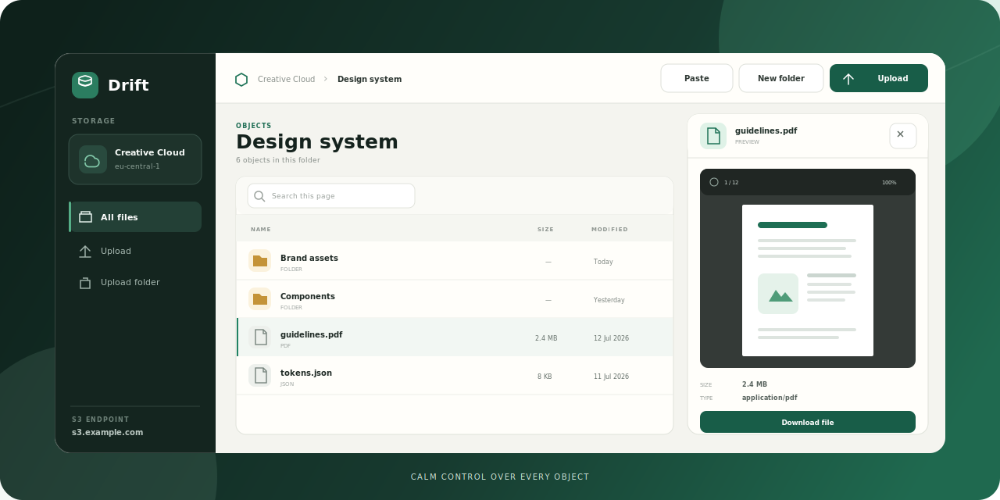
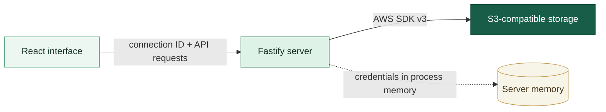

<h1 align="center">Drift</h1>

<p align="center">
  Спокойное рабочее пространство для ваших S3-бакетов.<br />
  Просматривайте, переносите и открывайте объекты без тяжёлых desktop-клиентов.
</p>

<p align="center">
  
  
  
  
  
</p>

<p align="center">
  
</p>

> [!NOTE]
> Превью выше использует только вымышленные данные. Настоящие endpoint, bucket name и ключи доступа не хранятся в репозитории.

## Зачем Drift

Большинство S3-инструментов либо перегружены настройками, либо удобны только для одной операции. Drift собирает повседневную работу с объектным хранилищем в одном аккуратном веб-интерфейсе: подключился, нашёл файл, посмотрел содержимое и продолжил работу.

- **Любой S3-compatible provider** — AWS S3, MinIO, Timeweb Cloud и другие реализации S3 API.
- **Папки как в привычном проводнике** — загрузка и скачивание целых деревьев директорий.
- **Предпросмотр без лишних скачиваний** — изображения, PDF, JSON, код и текстовые файлы.
- **Local-first** — ключи остаются на вашем Node.js-сервере и не попадают в клиентский bundle.

## Возможности

| | Возможность | Что внутри |
| :--: | --- | --- |
| 🗂️ | **Навигация** | Папки, breadcrumbs, поиск и сортировка на странице, S3 continuation token и настраиваемый размер страницы |
| ⬆️ | **Загрузка** | Несколько файлов, drag-and-drop и целые папки с сохранением вложенной структуры |
| ⬇️ | **Скачивание** | Потоковая отдача файлов и создание ZIP для директории без сборки архива в памяти |
| ✂️ | **Работа с объектами** | Контекстное меню, копирование, вырезание, вставка, переименование, перенос и рекурсивное удаление |
| 👁️ | **Предпросмотр** | Изображения, текст, исходный код и PDF.js-просмотрщик с масштабом и полноэкранным режимом |
| ⚡ | **Производительность** | Переиспользование S3-клиентов, параллельные загрузки и копирование объектов ограниченными пакетами |

## Быстрый старт

Понадобится [Node.js](https://nodejs.org/) 22 или новее.

```powershell
git clone https://github.com/Epoxidex/drift-s3-browser.git
cd drift-s3-browser
npm install
npm run dev
```

Откройте [http://127.0.0.1:5173](http://127.0.0.1:5173) и добавьте подключение через стартовый экран. Введённые параметры существуют только в памяти серверного процесса и исчезнут после его перезапуска.

### Подключение из `.env`

Если нужен заранее настроенный локальный бакет:

```powershell
Copy-Item .env.example .env
```

Заполните созданный `.env` своими значениями:

```dotenv
S3_ENDPOINT=https://s3.example.com
S3_BUCKET=my-private-bucket
S3_REGION=us-east-1
S3_ACCESS_KEY_ID=replace-me
S3_SECRET_ACCESS_KEY=replace-me
S3_FORCE_PATH_STYLE=true
```

> [!IMPORTANT]
> Не коммитьте `.env`. Файл уже добавлен в `.gitignore`, а в `.env.example` должны оставаться только фиктивные значения.

## Как это устроено



React отвечает только за интерфейс. Fastify проксирует операции к S3, стримит содержимое объектов, собирает ZIP и не возвращает Secret Access Key обратно в браузер.

### Стек

- **React 19 + TypeScript + Vite** — клиентское приложение;
- **Fastify** — локальный API и production-сервер;
- **AWS SDK for JavaScript v3** — S3-команды и multipart upload;
- **PDF.js** — безопасный PDF-просмотрщик;
- **Archiver** — потоковая упаковка директорий в ZIP;
- **Vitest** — тесты серверной логики.

## Настройка

| Переменная | По умолчанию | Назначение |
| --- | --- | --- |
| `S3_ENDPOINT` | — | URL S3-совместимого API |
| `S3_BUCKET` | — | Название бакета |
| `S3_REGION` | — | Регион подписи запросов |
| `S3_ACCESS_KEY_ID` | — | Access Key |
| `S3_SECRET_ACCESS_KEY` | — | Secret Access Key |
| `S3_FORCE_PATH_STYLE` | `true` | `true` для path-style, `false` для virtual-hosted-style адресации |
| `HOST` | `127.0.0.1` | Адрес локального API |
| `PORT` | `4173` | Порт API и production-приложения |

### Права S3

Точный policy зависит от провайдера и нужных операций:

| Сценарий | Обычно необходимые разрешения |
| --- | --- |
| Просмотр бакета | `s3:ListBucket` |
| Предпросмотр и скачивание | `s3:GetObject` |
| Загрузка, создание папок и копирование | `s3:PutObject` |
| Удаление, вырезание и перенос | `s3:DeleteObject` |

## Безопасность

- Secret Access Key никогда не возвращается из API в браузер.
- Подключения из формы хранятся только в памяти Node.js-процесса.
- В `sessionStorage` сохраняется случайный идентификатор подключения, а не S3-ключи.
- Сервер по умолчанию доступен только через `127.0.0.1`.
- HTML, SVG и неизвестные MIME-типы отдаются как вложения и не исполняются внутри приложения.
- Текстовый предпросмотр ограничен первыми 512 КБ.

> [!WARNING]
> Сейчас Drift рассчитан на локальное использование одним пользователем. Не публикуйте сервер напрямую в интернет без HTTPS, пользовательской авторизации, CSRF-защиты и внешнего менеджера секретов.

## Разработка

```powershell
# API и Vite с hot reload
npm run dev

# TypeScript + тесты + production-сборка
npm run check

# Только unit-тесты
npm test

# Read-only проверка подключения из .env
npm run check:s3
```

Production-сборка:

```powershell
npm run build
npm start
```

Готовое приложение будет доступно на [http://127.0.0.1:4173](http://127.0.0.1:4173).

<details>
<summary><strong>Структура проекта</strong></summary>

```text
src/                    React-интерфейс
  components/           браузер объектов и предпросмотр
server/                 Fastify API и S3-операции
scripts/                служебные проверки
docs/assets/            изображения для документации
```

</details>

## Ограничения S3

В объектном хранилище нет настоящих папок и атомарного перемещения. Drift отображает префиксы как директории, а перенос выполняет через копирование с последующим удалением. Для больших деревьев эта операция может занять время и требует прав одновременно на чтение, запись, перечисление и удаление объектов.

## Дальше

- множественное выделение и массовые операции;
- просмотр и восстановление версий объектов;
- multipart upload через временные ссылки для очень больших файлов;
- поиск по всему бакету через серверный индекс;
- сохранённые профили подключения через системное хранилище секретов.

---

<p align="center">
  <strong>Drift</strong> — меньше шума между вами и вашими файлами.
</p>
